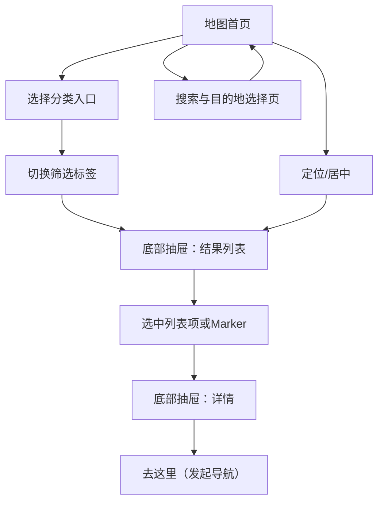

## 1. Product Overview
在小程序地图首页中完善顶部栏、分类入口、筛选标签与底部结果卡/详情抽屉，提升无障碍设施（如停车位/厕所/坡道/电梯等）的查找与到达效率。
面向需要快速定位并导航到无障碍设施的用户，通过“地图点位 + 筛选 + 抽屉详情 + 一键去这里”形成闭环。

## 2. Core Features

### 2.1 Feature Module
1. **地图首页**：顶部栏（定位/搜索/收藏/消息入口）、地图与点位、分类入口、筛选标签、底部结果卡列表、详情抽屉、地图右侧控件、浮动快捷按钮。
2. **搜索与目的地选择页**：搜索框、历史/推荐（可选）、搜索结果列表、选择目的地并回填地图。

### 2.3 Page Details
| Page Name | Module Name | Feature description |
|-----------|-------------|---------------------|
| 地图首页 | 顶部栏 | 显示当前城市/区域并支持切换；提供“输入你想去的地点”的搜索入口；提供收藏入口与消息入口（仅跳转，不定义消息体系细节）。 |
| 地图首页 | 地图与点位呈现 | 展示地图底图；按当前分类与筛选条件渲染点位 Marker；点击 Marker 聚焦并触发底部抽屉进入“结果卡/详情”。 |
| 地图首页 | 分类入口（图标栅格） | 提供一行可横向滑动的分类入口（如：无障碍厕所/无障碍停车位/坡道/电梯/公交等）；点击后切换当前分类并刷新点位与结果列表。 |
| 地图首页 | 筛选标签（Chip） | 提供“全部 + 当前分类下常用标签”筛选；支持单选（默认）并高亮当前筛选；切换后刷新点位与结果列表。 |
| 地图首页 | 底部结果卡（半屏列表态） | 以半屏抽屉展示结果列表；每条结果显示：分类标识/名称、距离、评分（若有）、“查看详情”“去这里”；支持上拉展开更多结果、下拉回到半屏。 |
| 地图首页 | 详情抽屉（半屏详情态） | 点击“查看详情”或选中列表项/Marker 后进入详情态；展示：名称、地址/区域、距离；展示“附近的无障碍设施”推荐卡片（基于当前点位周边）；提供“去这里”主按钮。 |
| 地图首页 | 抽屉态切换与手势 | 支持抽屉三态：收起（仅露出把手）/半屏（列表）/半屏（详情）；支持拖拽把手切换；点击地图空白处收起抽屉（保持筛选不变）。 |
| 地图首页 | 地图右侧控件 | 提供“图层（可选）/定位到我/缩放”等控件；点击“定位”将地图中心回到用户位置并刷新周边结果。 |
| 地图首页 | 浮动快捷按钮 | 提供拍照/上传或“问题上报/新增点位”（以截图中的相机与绿色按钮为参考）入口；点击仅跳转到对应流程（不在本文定义后续页面）。 |
| 搜索与目的地选择页 | 关键词搜索 | 输入关键词实时或点击搜索触发检索；展示结果列表（名称+地址）；选择一项后回到地图首页并以该点为中心更新结果。 |

## 3. Core Process
### 3.1 主要用户流程
- 浏览与筛选流程：你进入地图首页 → 选择分类入口（如“无障碍停车位”）→ 选择/切换筛选标签（如“全部/距离最近/评分最高”等，具体标签以产品配置为准）→ 底部抽屉展示列表并随筛选更新。
- 点位查看流程：你点击地图上的 Marker 或列表项 → 抽屉切换到详情态 → 查看名称/地址/距离与附近设施推荐 → 点击“去这里”发起导航。
- 搜索目的地流程：你点击顶部搜索框 → 在搜索页输入关键词并选择结果 → 返回地图首页并以选中地点为中心刷新点位与列表。
- 定位刷新流程：你点击右侧“定位/居中”按钮 → 地图居中到你的位置 → 自动刷新当前分类与筛选下的周边结果。

