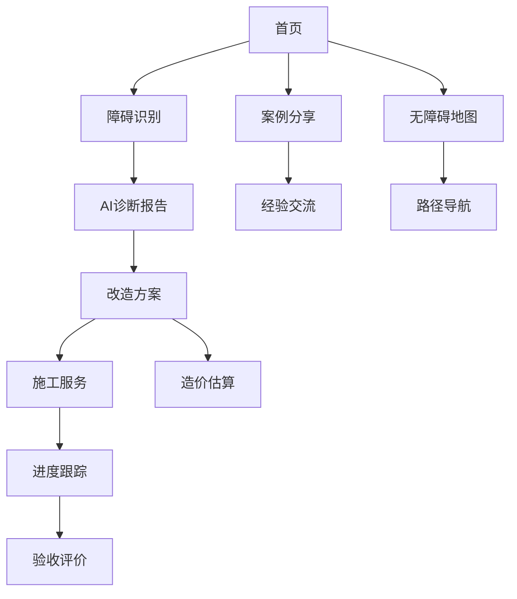

## 1. 产品概述
社区无障碍智能平台是一个专为残障人士、老年人等群体设计的综合性服务小程序。通过AI技术和社区协作，提供无障碍设施地图导航、障碍识别诊断、个性化改造方案、施工服务对接及经验分享等一站式服务，解决特殊群体出行难题，提升社区无障碍环境建设水平。

目标用户包括残障人士、老年人、社区管理员、志愿者、施工团队等，致力于构建包容性社区环境，推动无障碍设施建设标准化和智能化。

## 2. 核心功能

### 2.1 用户角色
| 角色 | 注册方式 | 核心权限 |
|------|----------|----------|
| 普通用户 | 微信授权注册 | 浏览地图、上传障碍、查看方案、发布需求 |
| 认证用户 | 实名认证+资质审核 | 标注设施、发布案例、评价服务 |
| 管理员 | 后台分配 | 审核内容、管理用户、维护数据 |
| 施工团队 | 企业认证+资质审核 | 接单施工、更新进度、接收评价 |
| 志愿者 | 申请+培训认证 | 协助标注、审核信息、社区服务 |

### 2.2 功能模块
本平台包含以下核心页面：
1. **首页**：地图导航入口、快捷功能入口、热门案例展示
2. **无障碍地图页**：设施标注、路径规划、实时导航
3. **障碍识别页**：拍照上传、AI诊断、报告查看
4. **改造方案页**：方案推荐、个性化定制、造价估算
5. **施工服务页**：需求发布、团队匹配、合同签订
6. **进度跟踪页**：施工状态、节点照片、在线沟通
7. **案例分享页**：案例浏览、发布分享、互动交流
8. **个人中心页**：用户信息、历史记录、设置管理

### 2.3 页面详情
| 页面名称 | 模块名称 | 功能描述 |
|----------|----------|----------|
| 首页 | 地图入口 | 显示社区无障碍地图快速入口，支持一键导航 |
| 首页 | 功能导航 | 提供障碍识别、方案生成、施工对接等快捷入口 |
| 首页 | 推荐案例 | 展示优质改造案例轮播，支持点击查看详情 |
| 无障碍地图页 | 地图展示 | 基于高德/百度地图API，显示无障碍设施位置标注 |
| 无障碍地图页 | 设施状态 | 实时显示设施状态（正常、障碍、维修中） |
| 无障碍地图页 | 路径规划 | 输入目的地后自动生成最优无障碍通行路线 |
| 无障碍地图页 | 语音导航 | 提供清晰的语音播报和图文导航指引 |
| 障碍识别页 | 影像上传 | 支持拍摄或选择照片/视频上传障碍情况 |
| 障碍识别页 | AI诊断 | 智能识别障碍物类型，评估不符合规范的具体问题 |
| 障碍识别页 | 诊断报告 | 生成结构化报告，指出问题及对特定人群的影响 |
| 改造方案页 | 方案匹配 | 从标准库中智能匹配适合的改造方案 |
| 改造方案页 | 个性化定制 | 根据用户输入的尺寸、材质偏好优化方案 |
| 改造方案页 | 造价估算 | 自动计算材料费用和人工成本，生成明细预算 |
| 施工服务页 | 需求发布 | 填写工程信息，一键发布施工需求 |
| 施工服务页 | 智能匹配 | 根据条件推荐合适的认证施工团队 |
| 施工服务页 | 合同签订 | 在线签订电子协议，明确双方权责 |
| 进度跟踪页 | 状态更新 | 实时显示施工进度百分比和当前阶段 |
| 进度跟踪页 | 照片记录 | 查看关键施工节点的前后对比照片 |
| 进度跟踪页 | 在线沟通 | 支持与施工方实时消息交流 |
| 进度跟踪页 | 验收评价 | 完工后进行质量确认和服务评分 |
| 案例分享页 | 案例展示 | 浏览图文结合的完整改造案例 |
| 案例分享页 | 互动功能 | 支持点赞、收藏、评论、提问等互动 |
| 案例分享页 | 经验交流 | 在论坛中讨论改造心得和政策信息 |
| 个人中心页 | 用户信息 | 显示个人资料、认证状态和权限等级 |
| 个人中心页 | 历史记录 | 查看上传记录、方案历史和施工订单 |
| 个人中心页 | 设置管理 | 修改个人信息、通知设置和隐私设置 |

## 3. 核心流程

### 3.1 障碍识别与改造流程
用户在日常出行中遇到无障碍设施问题时，可通过小程序拍照上传，AI系统快速识别并生成诊断报告。基于诊断结果，系统自动推荐个性化改造方案，包含详细设计图纸和造价预算。用户确认方案后发布施工需求，平台匹配合适的施工团队，全程跟踪施工进度直至完工验收。

### 3.2 社区协作流程
认证用户和管理员可在地图上标注无障碍设施，实时更新设施状态。志愿者协助审核信息准确性，施工团队分享改造案例，形成良性社区生态。所有用户可浏览案例获取灵感，在论坛中交流经验，共同推动社区无障碍环境改善。

## 4. 用户界面设计

### 4.1 设计风格
- **主色调**：无障碍蓝 (#1890FF) 搭配温暖橙 (#FA8C16)
- **辅助色**：深灰 (#595959) 和浅灰 (#F5F5F5) 用于文字和背景
- **按钮样式**：圆角矩形设计，主要操作为实心按钮，次要操作为边框按钮
- **字体规范**：主标题18px加粗，正文14px常规，提示文字12px
- **布局风格**：卡片式布局，信息层次清晰，操作按钮置底
- **图标风格**：使用圆润线条图标，符合无障碍设计原则

### 4.2 页面设计概述
| 页面名称 | 模块名称 | UI元素 |
|----------|----------|--------|
| 首页 | 地图入口 | 大尺寸卡片展示，包含地图缩略图和"立即导航"按钮 |
| 首页 | 功能导航 | 2x2网格布局，图标+文字，点击区域足够大 |
| 障碍识别页 | 上传区域 | 虚线框提示区域，支持点击和拖拽上传 |
| 改造方案页 | 方案卡片 | 左右滑动切换方案，显示3D效果图和关键参数 |
| 施工服务页 | 团队列表 | 卡片式展示团队信息，包含评分、案例数、距离等 |
| 进度跟踪页 | 时间轴 | 垂直时间轴显示施工节点，配以前后对比照片 |
| 案例分享页 | 瀑布流 |  Pinterest风格瀑布流布局，图片为主文字为辅 |

### 4.3 响应式设计
采用移动优先设计策略，主要适配微信小程序环境。界面元素尺寸符合无障碍操作标准，按钮高度不低于44px，文字对比度达到WCAG 2.1 AA级标准。支持字体大小调节，为视障用户提供高对比度模式。

### 4.4 无障碍设计规范
- 所有图片元素添加替代文本描述
- 支持语音输入和语音播报功能
- 提供高对比度显示模式
- 界面元素支持屏幕阅读器识别
- 操作反馈通过视觉、听觉、触觉多种方式呈现