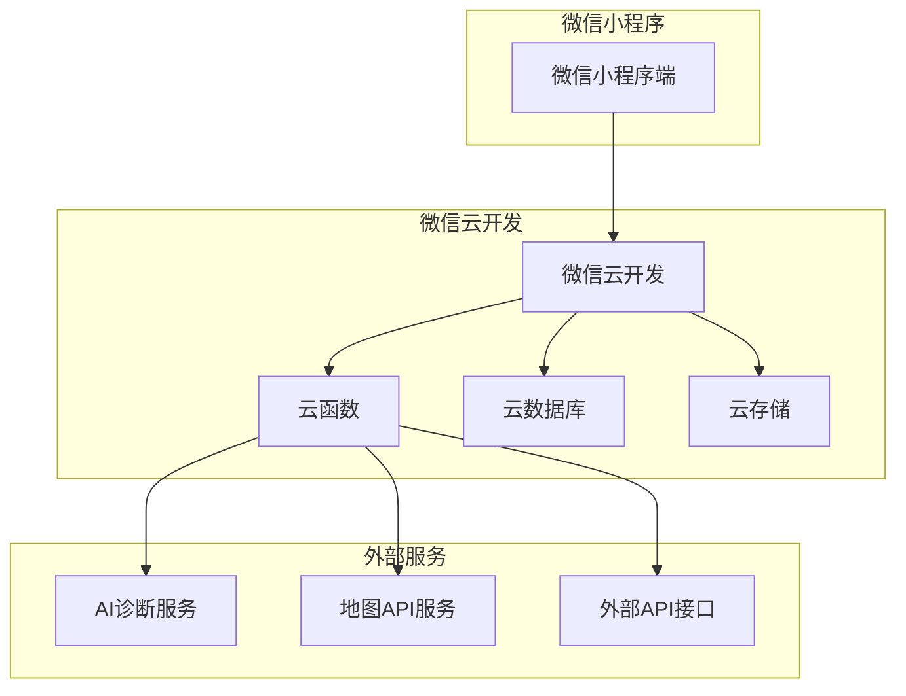
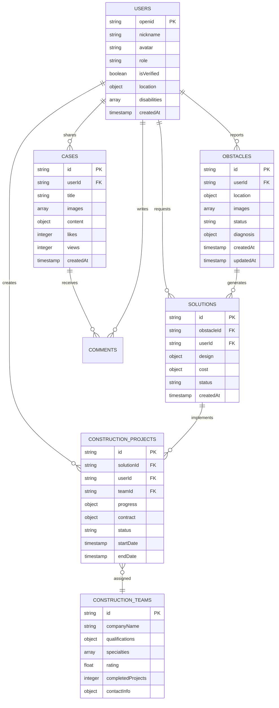

## 1. 架构设计



## 2. 技术栈描述

- **前端**：微信小程序原生框架 + WXML + WXSS + JavaScript
- **初始化工具**：微信开发者工具
- **后端**：微信云开发（Cloud Functions）
- **数据库**：微信云数据库（类MongoDB）
- **文件存储**：微信云存储
- **AI服务**：腾讯云AI视觉识别API
- **地图服务**：高德地图小程序SDK
- **外部API**：建材价格爬虫API、短信验证API

## 3. 路由定义

| 页面路径 | 页面名称 | 功能描述 |
|----------|----------|----------|
| /pages/index/index | 首页 | 平台入口，功能导航 |
| /pages/map/map | 无障碍地图 | 设施标注与路径规划 |
| /pages/diagnosis/diagnosis | 障碍识别 | 拍照上传与AI诊断 |
| /pages/solution/solution | 改造方案 | 方案推荐与造价估算 |
| /pages/construction/construction | 施工服务 | 需求发布与团队匹配 |
| /pages/progress/progress | 进度跟踪 | 施工状态与沟通 |
| /pages/cases/cases | 案例分享 | 案例浏览与互动交流 |
| /pages/profile/profile | 个人中心 | 用户信息与管理 |
| /pages/login/login | 登录页 | 微信授权登录 |
| /pages/register/register | 注册页 | 用户信息完善 |

## 4. 云函数定义

### 4.1 AI诊断云函数
```javascript
// 云函数名称：aiDiagnosis
// 调用方式：wx.cloud.callFunction
// 参数：
{
  imageUrl: string,  // 图片云存储地址
  location: {
    latitude: number,
    longitude: number
  },
  userType: string   // 用户类型：wheelchair, elderly, etc.
}

// 返回结果：
{
  diagnosisId: string,
  obstacleType: string,      // 障碍物类型
  severity: number,          // 严重程度 1-5
  standardViolations: array, // 违反的标准条款
  impactAnalysis: object,    // 对不同用户群体的影响
  suggestions: array,         // 改进建议
  confidence: number         // AI识别置信度
}
```

### 4.2 方案生成云函数
```javascript
// 云函数名称：generateSolution
// 参数：
{
  diagnosisId: string,
  userRequirements: {
    budget: number,          // 预算范围
    materialPreference: string, // 材质偏好
    urgency: string          // 紧急程度
  },
  siteInfo: {
    dimensions: object,     // 场地尺寸
    existingConditions: object // 现有条件
  }
}

// 返回结果：
{
  solutions: array,        // 推荐方案列表
  costEstimation: object,   // 造价估算
  timeline: object,        // 工期预估
  difficulty: number        // 施工难度 1-5
}
```

### 4.3 施工匹配云函数
```javascript
// 云函数名称：matchConstructionTeam
// 参数：
{
  projectType: string,     // 工程类型
  location: object,        // 地理位置
  budgetRange: object,     // 预算范围
  timeline: object,        // 时间要求
  specialRequirements: array // 特殊要求
}

// 返回结果：
{
  matchedTeams: array,     // 匹配的施工团队
  recommendations: string,   // 匹配建议
  contactInfo: array        // 联系方式
}
```

## 5. 数据库设计

### 5.1 数据模型定义


### 5.2 数据定义语言

#### 用户集合（users）
```javascript
// 集合名称：users
// 索引：openid（唯一）
{
  _id: ObjectId,
  openid: String,           // 微信openid
  nickname: String,         // 用户昵称
  avatar: String,          // 头像URL
  role: String,            // 角色：user, volunteer, admin, constructor
  isVerified: Boolean,     // 是否认证
  location: {
    type: 'Point',
    coordinates: [Number, Number] // [经度, 纬度]
  },
  disabilities: [String],   // 残障类型
  contactInfo: {
    phone: String,
    email: String
  },
  createdAt: Date,
  updatedAt: Date
}
```

#### 障碍物集合（obstacles）
```javascript
// 集合名称：obstacles
// 索引：location（地理索引）
{
  _id: ObjectId,
  userId: String,          // 上报用户ID
  location: {
    type: 'Point',
    coordinates: [Number, Number]
  },
  address: String,         // 详细地址
  images: [String],         // 图片云存储地址数组
  status: String,           // 状态：pending, diagnosed, solving, solved
  diagnosis: {
    type: String,           // 障碍物类型
    severity: Number,       // 严重程度
    violations: [String],   // 违反规范
    impact: Object,       // 影响分析
    confidence: Number,    // AI置信度
    aiResult: Object      // AI原始结果
  },
  createdAt: Date,
  updatedAt: Date
}
```

#### 解决方案集合（solutions）
```javascript
// 集合名称：solutions
{
  _id: ObjectId,
  obstacleId: String,      // 关联的障碍物ID
  userId: String,          // 请求用户ID
  design: {
    type: String,          // 方案类型
    description: String,   // 方案描述
    drawings: [String],    // 设计图纸
    materials: [Object],  // 材料清单
    constructionSteps: [String] // 施工步骤
  },
  cost: {
    materials: Number,     // 材料费用
    labor: Number,         // 人工费用
    total: Number,        // 总费用
    currency: String      // 货币单位
  },
  timeline: {
    duration: Number,      // 工期（天）
    startDate: Date,      // 建议开始日期
    endDate: Date        // 预计完成日期
  },
  status: String,        // 状态：draft, approved, rejected, implemented
  createdAt: Date,
  updatedAt: Date
}
```

#### 施工项目集合（constructionProjects）
```javascript
// 集合名称：constructionProjects
{
  _id: ObjectId,
  solutionId: String,     // 关联的解决方案ID
  userId: String,         // 业主用户ID
  teamId: String,         // 施工团队ID
  progress: [{
    stage: String,         // 施工阶段
    percentage: Number,    // 完成百分比
    images: [String],     // 现场照片
    description: String,  // 阶段描述
    updatedAt: Date
  }],
  contract: {
    content: String,       // 合同内容
    signedAt: Date,       // 签订时间
    status: String       // 合同状态
  },
  status: String,        // 状态：pending, ongoing, completed, cancelled
  startDate: Date,
  endDate: Date,
  rating: {               // 用户评价
    score: Number,
    comment: String,
    images: [String]
  },
  createdAt: Date,
  updatedAt: Date
}
```

## 6. 安全与权限设计

### 6.1 数据访问权限
- **匿名用户**：仅可查看公开的案例和地图信息
- **普通用户**：可上报障碍、查看个人相关数据
- **认证用户**：可标注设施、发布案例、参与评价
- **管理员**：拥有所有数据的读写权限
- **施工团队**：可查看和更新关联的项目信息

### 6.2 数据安全策略
- 敏感数据（如用户信息）进行加密存储
- 图片上传进行内容安全审核
- 地理位置信息进行脱敏处理
- 定期数据备份和恢复机制
- API接口调用频率限制和异常监控

## 7. 性能优化

### 7.1 前端优化
- 图片懒加载和压缩处理
- 页面分包加载，减少首屏加载时间
- 本地缓存策略，减少重复数据请求
- 使用WebP格式图片，提升加载速度

### 7.2 后端优化
- 云函数冷启动优化
- 数据库索引优化
- 查询结果分页处理
- 热点数据缓存机制

### 7.3 地图服务优化
- 地图瓦片缓存
- 定位精度自适应
- 路径计算结果缓存
- 离线地图包支持