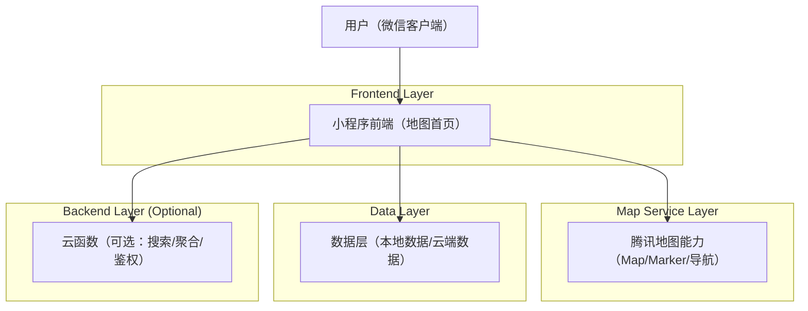
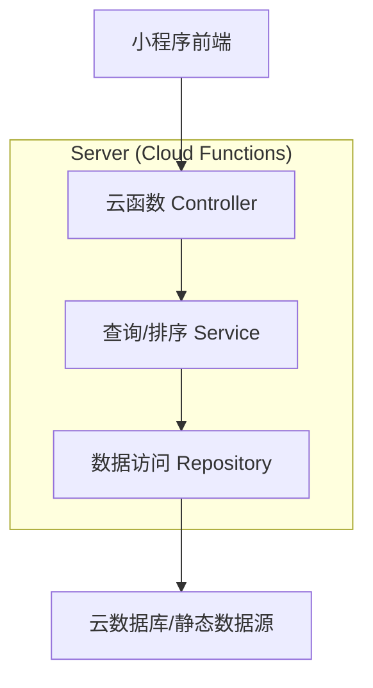
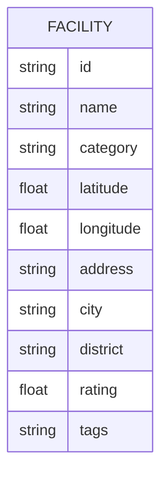

## 1.Architecture design


## 2.Technology Description
- Frontend: 微信小程序（WXML/WXSS/JavaScript）+ 组件化封装（分类入口/筛选标签/底部抽屉）
- Map SDK: 腾讯位置服务/小程序 Map 组件 + QQMap SDK（项目内 `utils/qqmap-wx-jssdk.js`）
- Backend: 微信云开发 Cloud Functions（项目内 `cloudfunctions/*`，用于搜索/内容安全/数据聚合等）
- Data: 
  - MVP：本地 JSON 数据（项目内 `shuju/*.json`）或静态资源
  - 进阶：云端存储（云数据库/对象存储），由云函数统一读写（避免前端直连造成权限扩散）

## 3.Route definitions
| Route | Purpose |
|-------|---------|
| /pages/map-view/index | 地图首页：顶部栏、分类入口、筛选标签、结果列表抽屉、详情抽屉、地图控件与交互 |
| /pages/*/search（待定） | 搜索与目的地选择：关键词检索与选择后回填地图（如项目已有搜索页则复用） |

## 4.API definitions (If it includes backend services)
> 本模块优先以前端本地检索/云函数查询为主；当数据量较大或需要统一排序/安全控制时启用云函数。

### 4.1 Core Types (shared)
```ts
export type FacilityCategory =
  | "accessible_parking"
  | "accessible_toilet"
  | "ramp"
  | "elevator"
  | "bus_stop"
  | "public_transport";

export type Facility = {
  id: string;
  name: string;
  category: FacilityCategory;
  latitude: number;
  longitude: number;
  address?: string;
  city?: string;
  district?: string;
  rating?: number; // 0-5
  tags?: string[]; // 用于筛选标签
};

export type SearchResult = {
  items: Facility[];
  total: number;
};
```

### 4.2 Cloud Function: facilitySearch (optional)
```
POST /cloudfunctions/facilitySearch
```

Request:
| Param Name | Param Type | isRequired | Description |
|-----------|------------|------------|-------------|
| keyword | string | false | 关键词（用于搜索页） |
| category | FacilityCategory | false | 当前分类 |
| tags | string[] | false | 当前筛选标签（单选也可用数组表达） |
| centerLat | number | true | 地图中心纬度 |
| centerLng | number | true | 地图中心经度 |
| radiusMeters | number | false | 半径（默认如 3000m） |
| limit | number | false | 返回条数（默认 20） |
| offset | number | false | 分页偏移 |

Response:
| Param Name | Param Type | Description |
|-----------|------------|-------------|
| items | Facility[] | 设施列表（建议按距离/权重排序） |
| total | number | 总数 |

Example
```json
{
  "category": "accessible_parking",
  "tags": ["all"],
  "centerLat": 28.23,
  "centerLng": 112.94,
  "radiusMeters": 3000,
  "limit": 20,
  "offset": 0
}
```

## 5.Server architecture diagram (If it includes backend services)


## 6.Data model(if applicable)
### 6.1 Data model definition


### 6.2 Data Definition Language
Facility Table (facilities)
```
CREATE TABLE facilities (
  id VARCHAR(64) PRIMARY KEY,
  name VARCHAR(255) NOT NULL,
  category VARCHAR(64) NOT NULL,
  latitude DOUBLE PRECISION NOT NULL,
  longitude DOUBLE PRECISION NOT NULL,
  address VARCHAR(255),
  city VARCHAR(64),
  district VARCHAR(64),
  rating DOUBLE PRECISION,
  tags JSON
);

CREATE INDEX idx_facilities_category ON facilities(category);
```
