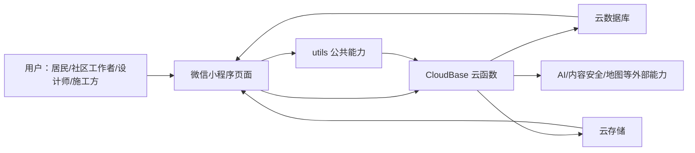
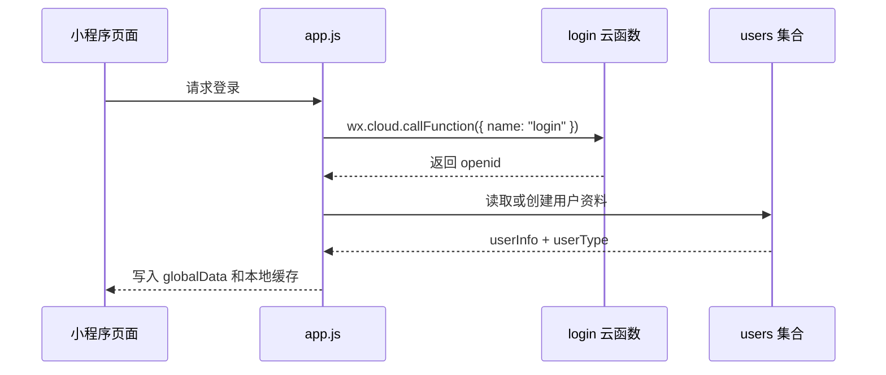
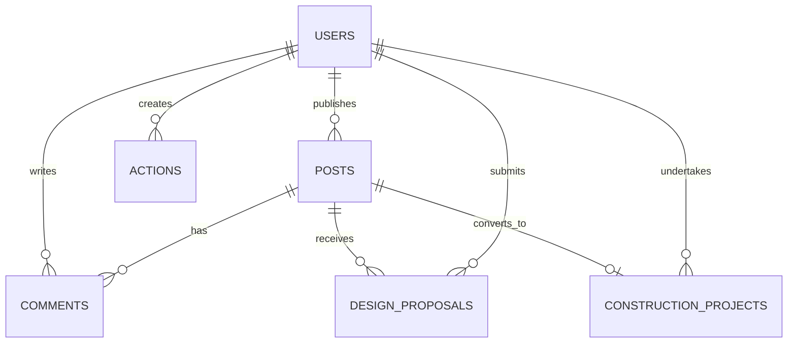
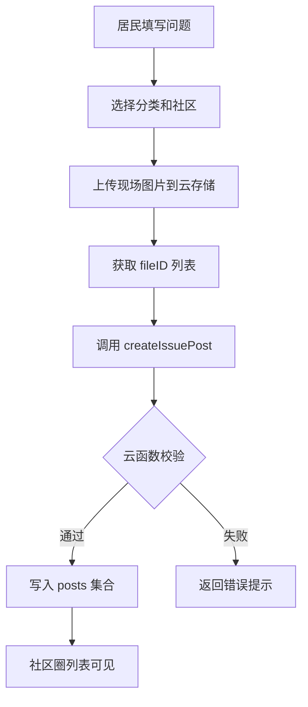
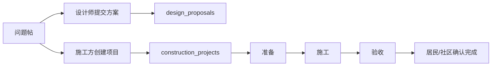
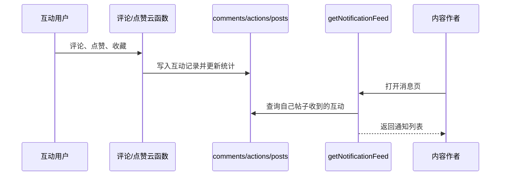
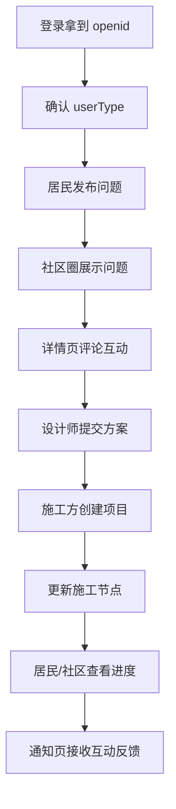

# 供需协同数字平台搭建教程

本文档根据当前小程序源码整理，目标不是复述项目申报材料，而是把这个微信小程序平台实际做出来的过程写清楚。项目主体采用微信小程序原生框架和 CloudBase 云开发，前端负责页面交互，云函数负责业务校验和数据库读写，云数据库和云存储分别承载结构化数据与图片文件。

## 1. 先搭出项目骨架

第一步先确定技术形态：用微信小程序承载居民、社区工作者、设计师、施工方四类角色，用云开发减少服务器部署成本。项目目录按“小程序页面、公共工具、云函数、文档”拆分。

```text
weapp-wechat-zhihu/
├── app.js                    # 小程序入口，初始化云开发、登录态、性能统计
├── app.json                  # 页面路由、tabBar、权限声明
├── config/index.js           # 云环境、地图 key、分页、图片限制等配置
├── pages/                    # 小程序页面
│   ├── community/            # 社区圈列表
│   ├── issue-edit/           # 居民问题上报
│   ├── post-detail/          # 帖子详情、评论、设计/施工入口
│   ├── login/                # 登录和身份选择
│   ├── switch-identity/      # 身份切换
│   ├── admin-certification/  # 认证审核
│   ├── design/               # 设计方案相关页面
│   └── project/              # 施工项目相关页面
├── utils/                    # 角色、权限、内容、收藏、关注、性能等公共逻辑
└── cloudfunctions/           # 云函数，承载核心业务逻辑
```

整体架构可以用下面这段 Mermaid 代码画出来：



实际入口在 `app.js`，启动后完成云开发初始化、系统信息读取、自动登录、云函数调用统计等准备工作。

```js
// app.js 中的核心启动逻辑
App({
  globalData: {
    userInfo: null,
    openid: null,
    userType: null,
    hasLogin: false
  },

  onLaunch() {
    this.initCloud();
    this.initPerfProfiler();
    this.patchCloudCallFunction();
    this.getSystemInfo();
    this.autoLogin();
    this.startUnreadPolling();
  },

  initCloud() {
    wx.cloud.init({
      env: config.CLOUD_ENV,
      traceUser: true
    });
  }
});
```

## 2. 配好页面路由和基础入口

第二步把平台要用到的页面注册到 `app.json`。本项目把“地图、社区、发布、消息、我的”做成底部入口，再把认证、详情、设计方案、施工项目等页面作为二级业务页面。

```json
{
  "pages": [
    "pages/index/index",
    "pages/login/index",
    "pages/community/community",
    "pages/post/create",
    "pages/notify/notify",
    "pages/mine/index",
    "pages/post-detail/index",
    "pages/issue-edit/index",
    "pages/switch-identity/index",
    "pages/admin-certification/index",
    "pages/design/proposal/index",
    "pages/project/create/index",
    "pages/project/detail/index",
    "pages/project/update/index"
  ],
  "tabBar": {
    "custom": true,
    "list": [
      { "pagePath": "pages/index/index", "text": "地图" },
      { "pagePath": "pages/community/community", "text": "社区" },
      { "pagePath": "pages/post/create", "text": "发布" },
      { "pagePath": "pages/notify/notify", "text": "消息" },
      { "pagePath": "pages/mine/index", "text": "我的" }
    ]
  }
}
```

这一步的结果是：用户打开小程序后能进入主导航，各角色的后续能力再由页面逻辑和云函数权限逐步放开。

## 3. 做登录态和统一云函数调用

第三步处理登录。微信小程序端通过 `login` 云函数拿到 `openid`，把 `openid`、用户资料、用户角色缓存到 `globalData` 和本地 storage。之后页面需要调用后端时，统一走 `app.callFunction`，避免每个页面重复写成功失败判断。

```js
// app.js 中封装的云函数调用
callFunction(name, data = {}) {
  return new Promise((resolve, reject) => {
    wx.cloud.callFunction({
      name,
      data
    }).then((res) => {
      if (res.result && res.result.success !== false) {
        resolve(res.result);
      } else {
        reject(new Error(res.result?.error || '调用失败'));
      }
    }).catch((err) => {
      console.error(`云函数 ${name} 调用失败:`, err);
      reject(err);
    });
  });
}
```

登录态流转如下：



## 4. 设计数据库集合

第四步先把数据边界定下来。当前代码主要围绕这些集合工作：

```js
// 核心集合设计示意
const collections = {
  users: {
    _openid: '用户 openid',
    userInfo: { nickName: '昵称', avatarUrl: '头像' },
    userType: 'normal | designer | contractor | communityWorker',
    certificationApplication: '认证申请信息',
    isAdmin: '是否管理员'
  },

  posts: {
    _openid: '发布者',
    type: 'issue | daily | case',
    status: 'pending | processing | completed',
    title: '标题',
    content: '正文',
    images: ['云存储 fileID'],
    community: '所属社区',
    location: 'Geo.Point',
    stats: { like: 0, comment: 0, collect: 0, view: 0 }
  },

  comments: {
    postId: '帖子 id',
    parentId: '父评论 id，可为空',
    authorOpenid: '评论者',
    content: '评论内容',
    userInfo: '评论者快照',
    userType: '评论者身份'
  },

  design_proposals: {
    postId: '关联问题帖',
    designerId: '设计师 openid',
    description: '设计建议',
    images: ['方案图片'],
    budgetAdjustment: '预算调整'
  },

  construction_projects: {
    issueId: '关联问题帖',
    contractorId: '施工方 openid',
    status: 'preparing | constructing | accepting',
    stages: ['准备', '施工', '验收'],
    confirmedBy: { owner: false, communityWorker: false }
  },

  actions: {
    _openid: '操作者',
    type: 'like_post | collect_post | like | collect',
    targetId: '目标内容 id',
    createTime: '操作时间'
  }
};
```

集合关系如下：



## 5. 做角色权限系统

第五步实现四类用户。项目里用 `utils/userTypes.js` 保存角色配置，前端根据角色展示不同入口，云函数再做一次服务端校验。

```js
// utils/userTypes.js 的结构简化示意
const USER_TYPES = {
  normal: {
    id: 'normal',
    label: '普通用户',
    permissions: {
      canCreateProject: false,
      canDesignSolution: false,
      canUpdateProgress: false,
      canViewUserContact: false
    }
  },
  designer: {
    id: 'designer',
    label: '设计师',
    needCertification: true,
    permissions: {
      canDesignSolution: true,
      canProvideConsultation: true
    }
  },
  contractor: {
    id: 'contractor',
    label: '施工方',
    needCertification: true,
    permissions: {
      canCreateProject: true,
      canUpdateProgress: true
    }
  },
  communityWorker: {
    id: 'communityWorker',
    label: '社区工作者',
    needCertification: true,
    permissions: {
      canVerifyIssue: true,
      canPublishPolicy: true,
      canViewUserContact: true
    }
  }
};
```

前端权限主要用于“显示什么按钮”，后端权限用于“真正能不能执行”。例如设计师提交方案时，`createDesignProposal` 云函数会重新读取 `users` 集合，并判断当前用户是不是 `designer`。

```js
// cloudfunctions/createDesignProposal/index.js 的权限判断
const userRes = await db.collection('users')
  .where({ _openid: OPENID })
  .field({ userType: true, userInfo: true })
  .limit(1)
  .get();

const user = userRes.data && userRes.data[0];
if (!user || user.userType !== 'designer') {
  return {
    success: false,
    error: 'only designer can create proposal'
  };
}
```

认证相关流程由 `applyCertification`、`getCertificationApplications`、`reviewCertification` 等云函数组成，管理员页面 `pages/admin-certification/index` 负责审核设计师、施工方和社区工作者的认证申请。

## 6. 实现居民问题上报

第六步做居民端核心流程：填写问题描述、选择分类、上传现场图片、选择位置、填写社区，然后发布到社区圈。前端页面主要在 `pages/issue-edit/index.js`，图片先上传到云存储，再把 fileID 和表单字段交给 `createIssuePost` 云函数。

```js
// pages/issue-edit/index.js 的提交流程简化
submitIssue() {
  this.uploadImages().then((fileIDs) => {
    const postData = {
      title: this.data.description.substring(0, 30),
      content: this.data.description,
      images: fileIDs,
      categoryId: this.data.selectedCategoryId,
      categoryName: this.data.selectedCategory,
      community: this.data.selectedCommunity,
      location: {
        latitude: this.data.latitude,
        longitude: this.data.longitude
      },
      address: this.data.address,
      userSuggestion: this.data.userSuggestion,
      aiSolution: this.data.aiSolution,
      contactPhone: this.data.contactPhone
    };

    return wx.cloud.callFunction({
      name: 'createIssuePost',
      data: postData
    });
  });
}
```

云函数端负责限制字段长度、校验社区、图片数量、地理位置和手机号格式，然后写入 `posts` 集合。

```js
// cloudfunctions/createIssuePost/index.js 的数据落库简化
const postData = {
  _openid: openid,
  type: 'issue',
  status: 'pending',
  title,
  content,
  images,
  category: categoryId,
  categoryId,
  categoryName,
  community,
  location: new db.Geo.Point(location.longitude, location.latitude),
  address,
  userSuggestion,
  aiSolution,
  contactPhone,
  userInfo: {
    nickName: userInfo.nickName || '微信用户',
    avatarUrl: userInfo.avatarUrl || '/images/zhi.png'
  },
  userType: userData.userType || 'resident',
  stats: { like: 0, comment: 0, collect: 0, view: 0 },
  createTime: db.serverDate(),
  updateTime: db.serverDate()
};

const result = await db.collection('posts').add({ data: postData });
```

问题上报流程图如下：



## 7. 实现社区圈列表和详情互动

第七步做社区圈。列表页 `pages/community/community.js` 调用 `getPublicData` 云函数读取帖子，并通过分页、字段投影、批量用户查询降低数据量。

```js
// pages/community/community.js 的列表查询简化
const queryData = {
  collection: 'posts',
  page: nextPage,
  pageSize: this.data.pageSize,
  orderBy: 'createTime',
  order: 'desc'
};

if (this.data.communityFilter !== 'all') {
  queryData.community = this.data.communityFilter;
}

wx.cloud.callFunction({
  name: 'getPublicData',
  data: queryData
});
```

`getPublicData` 云函数只允许访问白名单集合，并且列表模式只返回卡片真正需要的字段。这样社区圈滚动加载时不会把详情页字段、联系方式、无关数据一起传回前端。

```js
// cloudfunctions/getPublicData/index.js 的集合白名单和列表字段
const ALLOWED_COLLECTIONS = new Set(['posts', 'solutions', 'actions']);

function buildProjection(collection, fieldMode) {
  if (fieldMode !== 'list') return null;

  if (collection === 'posts') {
    return {
      _id: true,
      _openid: true,
      title: true,
      content: true,
      images: true,
      location: true,
      address: true,
      community: true,
      stats: true,
      userInfo: true,
      userType: true,
      type: true,
      status: true,
      category: true,
      createTime: true
    };
  }
}
```

详情页 `pages/post-detail/index.js` 承接评论、点赞、收藏、设计方案和施工项目入口。评论创建由 `createComment` 云函数完成，它会校验帖子是否存在、父评论是否属于同一帖子，并更新帖子评论数。

```js
// cloudfunctions/createComment/index.js 的核心逻辑简化
const postRes = await db.collection('posts')
  .doc(postId)
  .field({ _id: true })
  .get();

if (!postRes.data || !postRes.data._id) {
  return { success: false, error: 'post not found' };
}

const addRes = await db.collection('comments').add({
  data: {
    postId,
    content,
    parentId,
    authorOpenid: OPENID,
    userInfo: userProfile.userInfo,
    userType: userProfile.userType,
    likes: 0,
    likeCount: 0,
    createTime: db.serverDate()
  }
});

await db.collection('posts').doc(postId).update({
  data: { 'stats.comment': commentCount }
});
```

## 8. 接入设计师和施工方服务

第八步把“居民反馈”继续向“专业处理”推进。设计师可以在问题详情页提交设计方案，施工方可以基于问题创建施工项目。

设计师方案写入 `design_proposals` 集合：

```js
// cloudfunctions/createDesignProposal/index.js 的落库结构简化
const proposalData = {
  _openid: OPENID,
  postId,
  issueId: postId,
  designerId: OPENID,
  designerName,
  designerAvatar,
  description,
  content: description,
  images,
  budgetAdjustment,
  adjustmentReason,
  likes: 0,
  adopted: false,
  status: 'pending',
  createTime: db.serverDate(),
  updateTime: db.serverDate()
};

const proposalResult = await db.collection('design_proposals').add({
  data: proposalData
});
```

施工方创建项目时，`createProject` 会判断当前用户必须是 `contractor`，然后创建“准备、施工、验收”三阶段记录，并把原问题帖状态更新为处理中。

```js
// cloudfunctions/createProject/index.js 的施工项目结构简化
const projectData = {
  issueId: postId,
  title,
  contractorId: OPENID,
  contractorName,
  contractorAvatar,
  contactPhone,
  status: 'preparing',
  currentStage: '准备',
  stages: [
    { name: '准备', status: 'in_progress', images: [], actualCost: 0 },
    { name: '施工', status: 'pending', images: [], actualCost: 0 },
    { name: '验收', status: 'pending', images: [], actualCost: 0 }
  ],
  confirmedBy: {
    owner: false,
    communityWorker: false
  },
  createTime: db.serverDate(),
  updateTime: db.serverDate()
};

const result = await db.collection('construction_projects').add({
  data: projectData
});
```

专业服务闭环如下：



施工进度由 `updateProjectNode` 更新，云函数会校验操作者必须是该项目的施工方，然后推进阶段状态。

```js
// cloudfunctions/updateProjectNode/index.js 的权限和阶段推进
if (project.contractorId !== openid) {
  return {
    success: false,
    error: '无权限操作'
  };
}

stages[nodeIndex] = {
  ...stages[nodeIndex],
  status: 'completed',
  images,
  description: description || '',
  actualCost: actualCost || 0,
  completedAt: db.serverDate()
};
```

## 9. 做消息和状态同步

第九步处理消息触达。当前源码中已经落地的主要是站内通知和聊天监听：点赞、收藏、评论通知通过 `getNotificationFeed` 聚合；聊天页使用数据库 `watch` 监听消息变化。微信订阅消息可以作为后续增强接入，不要把它误写成已经完整落地。

```js
// cloudfunctions/getNotificationFeed/index.js 的通知聚合简化
const postRows = await db.collection('posts')
  .where({ _openid: OPENID })
  .field({ _id: true, title: true, content: true, images: true })
  .limit(MAX_POST_IDS)
  .get();

const postIds = posts.map((p) => p._id).filter(Boolean);

const res = await db.collection('comments')
  .where(_.and([
    { postId: _.in(postIds) },
    { authorOpenid: _.neq(OPENID) },
    { _openid: _.neq(OPENID) }
  ]))
  .orderBy('createTime', 'desc')
  .skip(skip)
  .limit(pageSize + 1)
  .get();
```

消息链路可以这样理解：



## 10. 加上安全校验和性能优化

第十步不是做新页面，而是把系统做稳。当前代码里有几类比较关键的工程处理。

第一类是共享校验，例如 `_shared/validate.js` 提供字符串、枚举、id 列表校验，云函数用它限制入参类型和长度。

```js
function validateString(value, { name = 'value', required = false, min = 0, max = 2000 } = {}) {
  if (value == null || value === '') {
    if (required) return { ok: false, error: `missing ${name}` };
    return { ok: true, value: '' };
  }

  if (typeof value !== 'string') {
    return { ok: false, error: `${name} must be string` };
  }

  const text = value.trim();
  if (required && !text) return { ok: false, error: `missing ${name}` };
  if (text.length < min) return { ok: false, error: `${name} too short` };
  if (text.length > max) return { ok: false, error: `${name} too long` };
  return { ok: true, value: text };
}
```

第二类是管理员校验，例如 `_shared/auth.js` 支持从环境变量读取超级管理员，也支持读取用户表中的管理员权限。

```js
async function isAdmin({ db, openid }) {
  const superAdmins = parseOpenidsFromEnv();
  if (superAdmins.includes(openid)) return true;

  const userQuery = await db.collection('users')
    .where({ _openid: openid })
    .field({ isAdmin: true, permissions: true })
    .limit(1)
    .get();

  const user = userQuery.data && userQuery.data[0];
  return user && (
    user.isAdmin === true ||
    !!(user.permissions && user.permissions.canManageUsers === true)
  );
}
```

第三类是性能优化。社区圈列表用了请求 token 避免旧请求覆盖新请求，用 `getUsersBatch` 批量补用户信息，用字段投影降低返回体积。

```js
// pages/community/community.js 中的请求 token 思路
const requestToken = (this._postsRequestToken || 0) + 1;
this._postsRequestToken = requestToken;

wx.cloud.callFunction({
  name: 'getPublicData',
  data: queryData
}).then(async (res) => {
  if (requestToken !== this._postsRequestToken) return;

  const raw = res.result.data || [];
  const authorIds = [...new Set(raw.map((p) => p._openid).filter(Boolean))];
  const batchUserMap = await this.fetchUsersBatch(authorIds);

  if (requestToken !== this._postsRequestToken) return;
  this.setData({ posts: mapped, loading: false });
});
```

## 11. 部署和调试顺序

最后一步才是部署。建议按下面顺序操作，排查问题会更快。

```text
1. 在微信开发者工具中导入项目目录。
2. 在 CloudBase 创建云环境，并把环境 id 写入 config/index.js。
3. 创建数据库集合：users、posts、comments、actions、design_proposals、construction_projects 等。
4. 上传并部署 cloudfunctions 目录下的云函数。
5. 在云环境变量中配置 SUPER_ADMIN_OPENIDS，用于后台审核和管理员能力。
6. 先跑 login 和 getUserInfo，确认 openid、用户资料、userType 正常。
7. 再测试居民发布问题，确认图片进入云存储、帖子进入 posts。
8. 测试社区圈列表和帖子详情，确认 getPublicData、getComments、createComment 正常。
9. 切换设计师和施工方身份，测试 createDesignProposal、createProject、updateProjectNode。
10. 最后测试消息页、通知列表、聊天实时监听和性能表现。
```

真实开发过程中，最关键的不是一次性把所有页面画完，而是先打通一条完整链路：



# 
